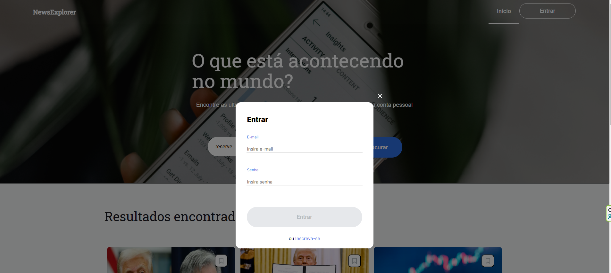

# News Explorer (FrontEnd)
 Projeto de final de curso da Tripleten Brasil.
### Objetivo
 Criar um aplicativo funcional de busca de notícias, utilizando tecnologias atualizadas e melhores práticas da área.

# Conceitos Chave:
 Permitir que o usuário busque notícias por palavras-chave.
 Permitir que o usuário se cadastre e autentique, caso o nome de usuário não esteja em uso.
 Permitir que o usuário faça login/logout.
 Permitir que o usuário salve notícias.
 Permitir que o usuário exclua notícias.

# Usuário pode:
 Ver uma página inicial/página de boas-vindas.
 Buscar sem erros.
 Se cadastrar e fazer login com autenticação validada.
 Salvar e excluir notícias.

# Especificação de Requisitos do Sistema
 A aplicação deve permitir que os usuários vejam notícias com base em buscas.
 A aplicação deve permitir que os usuários vejam suas notícias salvas.
 
# Funcionalidades
 Página inicial
 Busca de notícias
 Login
 Cadastro
 Alterar nome de usuário

# Tecnologias
 NPM
 Vite
 React
 React-Router-Dom
 React-hook-form 
 

